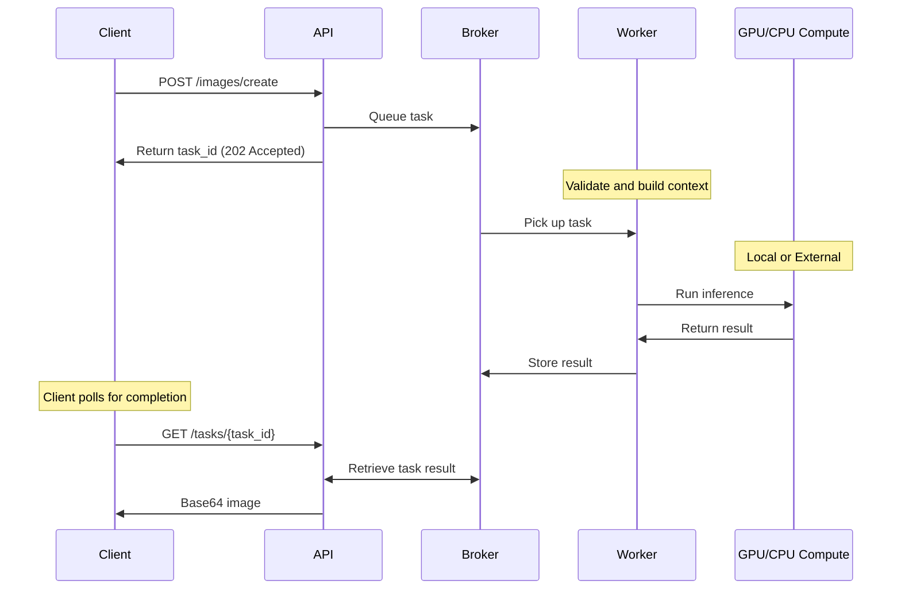

# deferred-diffusion

**Deferred Diffusion** is a **self-hosted, scalable AI inference stack** with a fully **typed, testable API**. It supports **local GPU models** and can route tasks to **external AI services** such as Replicate, OpenAI, or RunwayML. The system is **containerized**, automatically downloads all models and dependencies, and is **stateless**, allowing tasks to run across multiple workers without relying on local file paths. This makes deployments **predictable, cross-platform, and easy to scale**.


It provides a **modular API and worker architecture** built with **FastAPI** and **Celery**, letting local models and external providers run seamlessly in the same system. The API queues tasks through a message broker, and worker services pick them up for processing. Workers can execute:

- **Local ML pipelines** using the Python ecosystem (e.g., diffusers, PyTorch)
- **External inference tasks** via APIs such as Replicate, OpenAI, and RunwayML

An **intelligent model cache** keeps the last-used local model resident in GPU / CPU memory for fast reuse.

Clients interact with the API through clean typed REST endpoints, with a built-in **Swagger UI** for testing and inspection.

Example **Houdini** and **Nuke** clients are included to demonstrate integration into node-based VFX pipelines.

#### **Flow Example**



## Quick start

To pull and run the latest release.

```bash
docker compose down
docker compose -f docker-compose.release.yml pull
docker compose -f docker-compose.release.yml up -d --no-build
```

Or run the make command.

```bash
make up-latest-release
```

For production deployment instructions, see [DEPLOYMENT.md](DEPLOYMENT.md).

## Building

**All services run in Docker containers** - this ensures consistent environments and avoids duplicating model downloads across different setups. Nothing needs to run directly on the host machine except Docker and the client applications.

```bash
make all
```

### Local setup Windows

For local venv mainly to get intellisense on the packages and some local testing.

```bash
./start_venv_setup.bat
```

Or make your own env and install the requirements.

## Testing

Pytest is used for integration tests confirming the models run.

You can call from the make file.

```bash
make test-worker
make test-it-tests
```

See the make file for more info.

## Releasing

We have a github action setup to do the release based on any v*.*.\* tag.

To make a local release you can also run the make commands.

```bash
make create-release
make tag-and-push
```

## Requirements

- **Storage**: An NVMe drive with **at least 500GB** of available space is recommended.
- **GPU** Nvidia GPU with at least 12GB VRAM. 24GB recommended (Tested with RTX 3080ti, A4000, RTX 3090, RTX 5090)
- **RAM** Around 48-64Gb should be plenty for all containers.
- **Environment Variables**: Ensure all required environment variables are set on the host.

### Required Environment Variables

Server for the containers

```env
OPENAI_API_KEY=your-openai-key # For OpenAI services
RUNWAYML_API_SECRET=your-runway-secret # For RunwayML services
REPLICATE_API_TOKEN=your-replicate-token # For Replicate API access
HF_TOKEN=your-huggingface-token # For Hugging Face model access
DDIFFUSION_API_KEYS=Welcome1!,Welcome2! # API keys for authentication
```

For the clients where the tool sets are used

```env
DDIFFUSION_API_ADDRESS=http://127.0.0.1:5000 # API server address
DDIFFUSION_API_KEY=Welcome1! # API key for client authentication
```

## **Project Structure Overview**

This project follows a **feature-based structure**, grouping related components together by domain (`images`, `texts`, `videos`). This approach ensures a clear separation of concerns and improves maintainability, scalability, and collaboration.

We try to use plural to adhere to REST best practices.

### **Cohesion & Readability**

- All components related to a specific AI task (`images`, `texts`, `videos`) are grouped together.
- They are grouped in a sense of what main data type they return, but can have multi model inputs.
  - eg. images can accept image and text inputs but always returns image based data.
- Eliminates the need to navigate across multiple directories to understand a feature.
- New developers can quickly locate relevant code without confusion.

### **Scalability for AI Projects**

- AI models often require **domain-specific logic**. Keeping `schemas.py`, `context.py`, and `tasks/` in the same module makes it easier to extend functionality.
- If a new AI domain (`audio`, `3D`, etc.) is introduced, the structure remains consistent just duplicate the existing pattern.

```
/api
│── /images # Grouped by results type
│ ├── schemas.py # ✅ Pydantic schemas (data validation)
│ ├── router.py # ✅ API routes (FastAPI) Calls worker tasks
│── /texts
│ ├── ...
│── /videos
│ ├── ...
│── /common # ✅ Shared components
│── /utils # ✅ General-purpose utilities (helpers, formatters, etc.)
│── /tests # ✅ Tests mirror the /api structure
│── main.py # ✅ FastAPI entry point
│── worker.py # ✅ Celery
│── pytest.ini # ✅ Test configuration
```

```
/workers
│── /images # Grouped by results type
│ ├── local/ # ✅ Local AI model pipeline tasks (GPU queue)
│ ├── external/ # ✅ External AI model pipeline tasks (CPU queue)
│ ├── schemas.py # ✅ Pydantic schemas (data validation mirrors from API)
│ ├── context.py # ✅ Business logic layer
│ ├── tasks.py # ✅ Celery tasks route to local or external tasks. Name should match module
│── /texts
│ ├── ...
│── /videos
│ ├── ...
│── /common # ✅ Shared components
│── /utils # ✅ General-purpose utilities (helpers, formatters, etc.)
│── /tests # ✅ Tests mirror the /workers structure
│── worker.py # ✅ Celery
│── pytest.ini # ✅ Test configuration
```

## Clients

```
/clients
│── /it_tests
│ ├── generated/ # generated client
│ ├── tests/
│── /houdini
│ ├── python/generated/ # generated client
│── /nuke
│ ├── python/generated/ # generated client
│── openapi.json # API spec
```

Example clients for Houdini and Nuke are provided in the `/clients` directory.

See [clients/README.md](clients/README.md) for detailed setup instructions.

## Agentic

Example Agentic layer which is a bit experimental that demonstrates connection to the MCP server.

See [agentic/README.md](agentic/README.md) for more information.

## Model naming / pathing

User-facing model choices are simple names like "flux-1" or "flux-1-pro". The actual model calls and implementations are defined in the worker pipeline. Worker tasks follow these user-driven names but may share common logic for variants.

For example, "flux-1" might internally use:

- "black-forest-labs/FLUX.1-Krea-dev"
- "black-forest-labs/FLUX.1-Kontext-dev"
- "black-forest-labs/FLUX.1-Fill-dev"

Depending on the inputs (e.g., whether an image is provided), we internally route to the most appropriate model variant.

We avoid cluttering user model choices with minor versions (.1, .2, etc.) and instead select the best available minor version. This approach allows us to properly test and verify model behaviors for both external and local models without requiring users to understand implementation details.

The model pipelines themselves serve as the source of truth for what models are actually used. This is especially important given various optimizations and edge cases that may apply.

#### Model Registration Philosophy

Model definitions are **version-controlled in code**, not loaded dynamically from configuration files. We match celery task names to the module names for clarity.

This design choice ensures:

- **Full test coverage** and deterministic behavior across releases
- **Stable API contracts** between `/api` and `/workers`
- **Clear traceability** between user-facing model identifiers and their actual implementations

Developers who want to extend or modify available models can do so by editing the typed definitions directly in code:

- `api/images/schemas.py`
- `workers/images/tasks.py`
- `workers/images/local/...`

Each new model entry should include:

1. A Pydantic schema entry in `ModelName`
2. A corresponding task or pipeline implementation
3. Updated tests under `tests/images`

This deliberate coupling between **model definitions, pipelines, and tests** is what makes `deferred-diffusion` reliable and reproducible for self-hosted AI inference.
