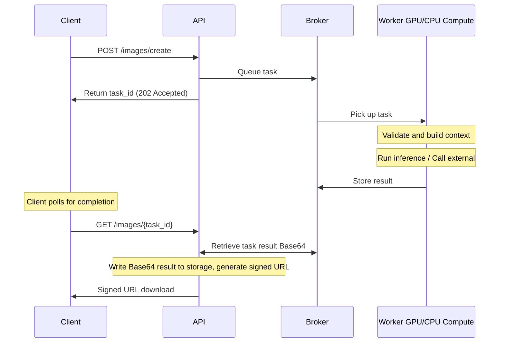
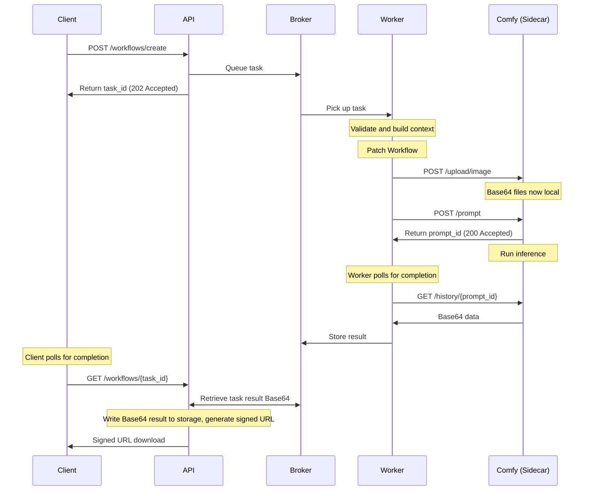

# deferred-diffusion

**Deferred Diffusion** is a **self-hosted, scalable AI inference stack** with a fully **typed, testable API**. It supports **local GPU workers** and can route tasks to **external AI providers**. The system is **containerized**, automatically downloads all models and dependencies, and is **stateless**, allowing tasks to run across multiple workers without relying on local file paths. This makes deployments **predictable, cross-platform, and easy to scale**.


It provides a **modular API and worker architecture** built with **FastAPI** and **Celery**, letting local models and external providers run seamlessly in the same system. Workers can execute:

- **Local ML pipelines** using the Python ecosystem (e.g., diffusers, PyTorch)
- **External inference tasks** are currently only run via **Replicate** and **OpenAI** APIs.
- **Optional advanced workflows** using a **ComfyUI sidecar** for user-driven pipelines (experimental, WIP)

Clients interact with the API through typed REST endpoints with a built-in **Swagger UI** for inspection and testing.

Example **Houdini** and **Nuke** clients are included to demonstrate integration into node-based VFX pipelines.

### Security & Air-Gapped Deployment

- **No dependency on unverified UIs**; all interaction is via the API or official clients.
- **Air-gap ready**: API server and workers can run in isolated networks, exposing only necessary ports and connections to external AI providers.
- **Controlled external access**: Only approved providers (Replicate and OpenAI) are called via their APIs. Uploaded data is retained only as long as necessary to complete the inference and is deleted soon after, minimizing exposure.
- **Traceable and reproducible**: Local models are version-controlled in code; no downloading from random external repositories.
- **Client / Workstations**: Don't need heavy GPUs, download models or call provider APIs directly.
- **API / Workers**: Workers remain fully stateless. The API temporarily stores inference results to generate signed URLs, but does not require access to your main network drives, maintaining strong isolation and clear boundaries.

#### **Basic Flow Example**



## **Project Structure Overview**

This project follows a **feature-based structure**, grouping related components together by domain (`images`, `texts`, `videos`). This approach ensures a clear separation of concerns and improves maintainability, scalability, and collaboration.

We use plural nouns to adhere to REST best practices.

- All components related to a specific AI task (`images`, `texts`, `videos`) are grouped together.
- They are grouped by the primary data type they return, but can have multi model inputs.
  - eg. images can accept image and text inputs but always returns image based data.
- Eliminates the need to navigate across multiple directories to understand a feature.
- New developers can quickly locate relevant code without confusion.
- AI models often require **domain-specific logic**. Keeping `schemas.py`, `context.py`, and `tasks/` in the same module makes it easier to extend functionality.
- If a new AI domain (`audio`, `3D`, etc.) is introduced, the structure remains consistent just duplicate the existing pattern.

### API

```
/api
│── /images # Grouped by results type
│ ├── schemas.py # ✅ Pydantic schemas (data validation)
│ ├── router.py # ✅ API routes (FastAPI) Calls worker tasks
│── /texts
│ ├── ...
│── /videos
│ ├── ...
│── /workflows # flexible user driven comfyui workflows (experimental, WIP)
│ ├── ...
│── /common # ✅ Shared components
│── /utils # ✅ General-purpose utilities (helpers, formatters, etc.)
│── /tests # ✅ Tests mirror the /api structure
│── main.py # ✅ FastAPI entry point
│── worker.py # ✅ Celery
│── pytest.ini # ✅ Test configuration
```

### Workers

```
/workers
│── /images # Grouped by results type
│ ├── local/ # ✅ Local AI model pipeline tasks (GPU queue)
│ ├── external/ # ✅ External AI model pipeline tasks (CPU queue)
│ ├── schemas.py # ✅ Pydantic schemas (data validation mirrors from API)
│ ├── context.py # ✅ Business logic layer
│ ├── tasks.py # ✅ Celery tasks route to local or external tasks. Name should match module
│── /texts
│ ├── ...
│── /videos
│ ├── ...
│── /workflows # validates and calls side car headless comfyui (experimental, WIP)
│ ├── ...
│── /common # ✅ Shared components
│── /utils # ✅ General-purpose utilities (helpers, formatters, etc.)
│── /tests # ✅ Tests mirror the /workers structure
│── worker.py # ✅ Celery
│── pytest.ini # ✅ Test configuration
```

### Clients

```
/clients
│── /it_tests
│ ├── generated/ # generated client
│ ├── tests/
│── /houdini
│ ├── python/generated/ # generated client
│── /nuke
│ ├── python/generated/ # generated client
│── openapi.json # API spec
```

Example clients for Houdini and Nuke are provided in the `/clients` directory.

See [clients/README.md](clients/README.md) for detailed setup instructions.

### Workflows (experimental, WIP)

This feature enables the use of a **ComfyUI sidecar** to execute advanced, user-driven pipelines with support for **patching workflows**, modifying inputs, and updating files as needed. Workflows can return a mixed list of image and video data.

> ⚠️ These run in a separate, isolated Docker container. They communicate with the main system only through stateless API calls / websockets and pull only the files needed for the workflow. ComfyUI's dynamic loading of custom nodes and Python code at runtime introduces **additional security considerations**, so these workflows are **experimental** and **require manual configuration**. Users must curate and sync their own custom nodes and models.

#### Workflow Flow

This diagram shows how a Worker interacts with the ComfyUI sidecar. It extends the standard domain/task flow by integrating Comfy workflows while keeping the core **API → Broker → Worker** logic consistent. All interactions with the ComfyUI sidecar are request scoped and stateless from the core system’s perspective.



### Agentic

Example Agentic layer which is a bit experimental that demonstrates connection to the MCP (Model Context Protocol) server.

See [agentic/README.md](agentic/README.md) for more information.

## Model Registration Philosophy

User-facing model choices are simple names like "flux-1" or "flux-1-pro". The actual model calls and implementations are defined in the worker pipeline. Worker tasks follow these user-driven names but may share common logic for variants.

For example, "flux-1" might internally use:

- "black-forest-labs/FLUX.1-Krea-dev"
- "black-forest-labs/FLUX.1-Kontext-dev"
- "black-forest-labs/FLUX.1-Fill-dev"

Depending on the inputs (e.g., whether an image is provided), we internally route to the most appropriate model variant.

We avoid cluttering user model choices with minor versions (.1, .2, etc.) and instead select the best available minor version. This approach allows us to properly test and verify model behaviors for both external and local models without requiring users to understand implementation details.

The model pipelines themselves serve as the source of truth for what models are actually used. This is especially important given various optimizations and edge cases that may apply.

Model definitions are **version-controlled in code**, not loaded dynamically from configuration files. We match celery task names to the module names for clarity.

This design choice ensures:

- **Full test coverage** and deterministic behavior across releases
- **Stable API contracts** between `/api` and `/workers`
- **Clear traceability** between user-facing model identifiers and their actual implementations

Developers who want to extend or modify available models can do so by editing the typed definitions directly in code:

- `api/images/schemas.py`
- `workers/images/tasks.py`
- `workers/images/local/...`

Each new model entry should include:

1. A Pydantic schema entry in `ModelName`
2. A corresponding task or pipeline implementation
3. Updated tests under `tests/images`

This deliberate coupling between **model definitions, pipelines, and tests** is what makes `deferred-diffusion` reliable and reproducible for self-hosted AI inference.

## Requirements

- **Storage**: An NVMe drive with **at least 500GB** of available space is recommended.
- **GPU**: Nvidia GPU with at least 12GB VRAM. 24GB recommended (Tested with RTX 3080ti, A4000, RTX 3090, RTX 5090)
- **RAM**: Around 48-64Gb should be plenty for all containers.
- **Environment Variables**: Ensure all required environment variables are set on the host.

## Environment Variables

Server for the containers

```env
OPENAI_API_KEY=your-openai-key # For OpenAI services
REPLICATE_API_TOKEN=your-replicate-token # For Replicate API access
HF_TOKEN=your-huggingface-token # For Hugging Face model access
DDIFFUSION_ADMIN_KEY=<generate-a-random-secret>
DDIFFUSION_STORAGE_ADDRESS=http://127.0.0.1:5000 # API server address required for signed URL store
```

> **Note**: You must use the `DDIFFUSION_ADMIN_KEY` to create your first API key via the `/api/admin/keys` endpoint before you can use the clients or Swagger UI.

For the clients where the tool sets are used

```env
DDIFFUSION_API_ADDRESS=http://127.0.0.1:5000 # API server address
DDIFFUSION_API_KEY=******* # API key for client authentication
```

## Quick start

To pull and run the latest release.

```bash
make up-latest-release
```

For example deployment of latest release see [DEPLOYMENT.md](DEPLOYMENT.md).

## Building

**All services run in Docker containers** - this ensures consistent environments and avoids duplicating model downloads across different setups. Nothing needs to run directly on the host machine except Docker and the client applications.

To build and run the core API and Workers:

```bash
make all
```

To build and run the optional ComfyUI sidecar (required for workflow tasks):

```bash
make up-comfy
```

### Local env

Only a minimal local venv is required to get intellisense on the packages, it-test calls and client generation.

```bash
./start_venv_setup.bat
```

Or make your own env and install the requirements. We don't add pytorch directly to the requirements as the container base image handles this. This is good as you don't need the cuda version locally.

```bash
pip install torch torchvision torchaudio
pip install -r api/requirements.txt
pip install -r workers/requirements.txt
```

## Testing

Pytest is used for integration tests confirming the models run.

You can call from the make file.

```bash
make test-worker-basic
make test-it-tests-basic
```

See the make file for more info.

## Releasing

We have a GitHub action setup to do the release based on any v*.*.\* tag.

To make a local release you can also run the make commands.

```bash
make create-release
make tag-and-push
```

## Logging

All services log exclusively to `stdout` and `stderr`. Flower and Redis contain task logs and kwargs identity metrics based on the submitted user's device and API key.

```bash
docker compose logs
```

You can extend this with centralized logging if needed, depending on your infrastructure.

This approach keeps the system portable, auditable, and compatible with air-gapped or restricted environments.

### Scaling / Multi-Worker

The provided `docker-compose.yml` is intended as a minimal example. You can scale workers horizontally by running multiple instances, or deploy using orchestration tools like **Docker Swarm** or **Kubernetes**.

All workers are stateless, so tasks can be processed independently across multiple nodes. This allows you to increase throughput without changing client interactions.
